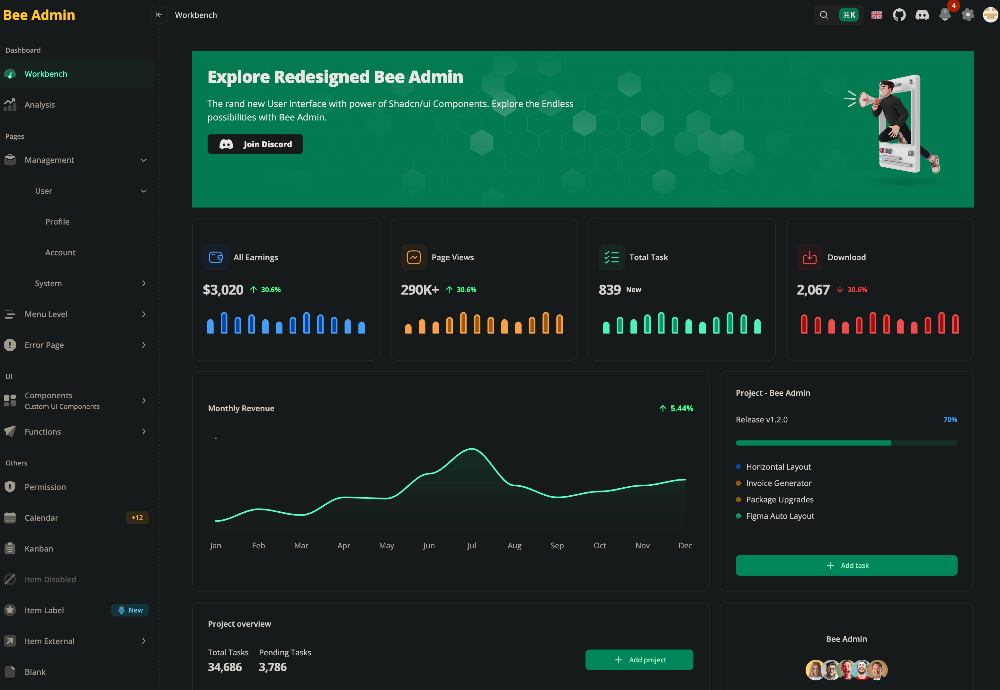

# 🐝 Bee React Admin

[](https://react.dev/)
[](https://www.typescriptlang.org/)
[](https://tailwindcss.com/)
[](https://vitejs.dev/)
[](LICENSE)
[](./CONTRIBUTING.md)

> 🧩 一个轻量、现代、可扩展的 React + TypeScript 管理后台模板。  
> ⚡️ 极速构建，清爽 UI，模块化结构，适合二次开发与企业管理系统快速搭建。

---

## ✨ 在线体验

👉 [Demo 预览地址](https://bee-admin-flax.vercel.app/)  
📦 [GitHub 仓库地址](https://github.com/yi-echo/bee-react-admin)
🧠 [后端仓库（Spring Boot）](https://github.com/yi-echo/bee-spring-boot-server)


---

## 

## 🚀 特性亮点

- ⚙️ **现代技术栈**：React 18 + TypeScript + Vite + TailwindCSS
- 🧭 **模块化路由与权限控制**：支持动态菜单和角色权限
- 🎨 **高颜值 UI 设计**：响应式布局，支持暗黑模式
- 🧩 **组件化开发**：可复用、可拓展的 UI 模块
- 🧰 **完善的工程化支持**：ESLint + Prettier + Husky + Commitlint
- 🌍 **多语言支持 (i18n)**：轻松适配全球化应用
- 📈 **性能优先**：极致构建速度与按需加载优化

---

## 🧱 技术栈

| 类别     | 技术                                                     |
| -------- | -------------------------------------------------------- |
| 前端框架 | [React 18](https://react.dev/)                           |
| 语言     | [TypeScript 5](https://www.typescriptlang.org/)          |
| 构建工具 | [Vite](https://vitejs.dev/)                              |
| 样式     | [TailwindCSS](https://tailwindcss.com/)                  |
| 路由     | [React Router v6](https://reactrouter.com/)              |
| 状态管理 | [Zustand](https://zustand-demo.pmnd.rs/) / Redux Toolkit |
| 代码规范 | ESLint + Prettier + Husky + Commitlint                   |

---

## ⚡️ 快速开始

```bash
# 克隆项目
git clone https://github.com/yi-echo/bee-react-admin.git

# 进入项目目录
cd bee-react-admin

# 安装依赖
pnpm install  # or npm install / yarn

# 启动项目
pnpm dev

# 构建项目
pnpm build
```
